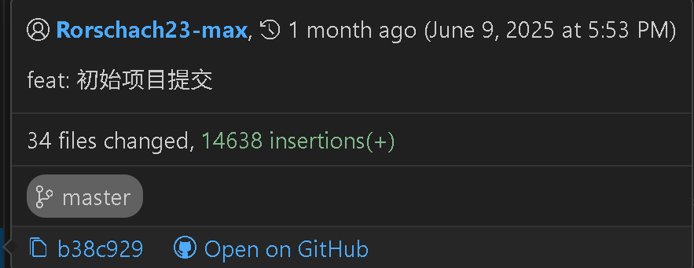
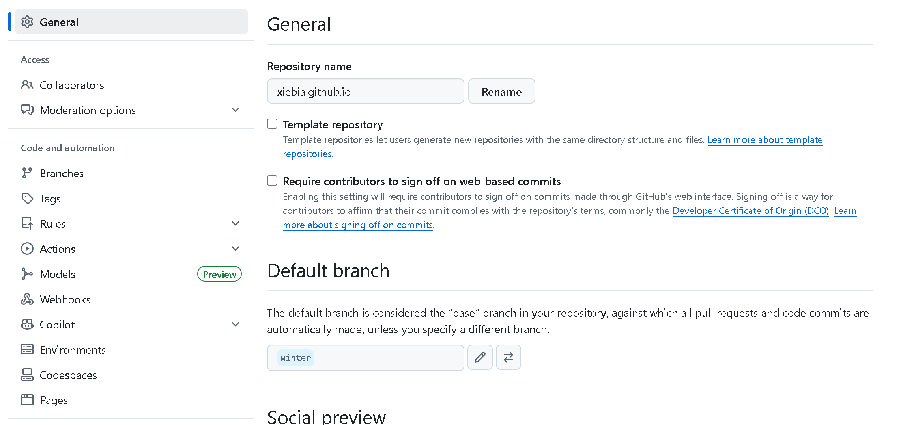
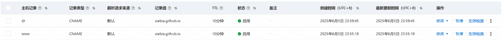

# xiebia.top 建站过程

## umi 框架快速生成



初始生成项目很简单 只需`pnpm dlx create-umi@latest`即可

这样做主要是为了初始化配置路由和项目总体架构。

## GitHub Pages 静态页面部署

通过上面的步骤可以得到一个本地运行的项目。但是没有办法通过网络访问。

为了让`xiebia.top`能够网络访问到，可以选择部署在服务器上，也可以用 github pages 部署，由于本网站目前还是静态页面，优先使用后者。

部署到 github pages 上很简单，将上面生成的代码放到 github 仓库[Rorschach23-max/xiebia.github.io](https://github.com/Rorschach23-max/xiebia.github.io)上，然后在对应仓库里修改设置即可



这样 winter 分支里的 index.html 文件就能够显示页面的内容了。

但是问题来了，我不希望我开发的页面，别人能够通过控制台看到我未经打包的 js 文件怎么办？不可能每次都在本地打包再上传仓库。这里我做了一个 github actions 流水线，每次代码推送到库里自动安装依赖并进行构建。

`deploy.yml`文件

```yml
name: 部署到GitHub Pages

on:
  push:
    branches:
      - winter # 当winter分支有推送时触发
    paths-ignore:
      - '**.md'
  workflow_dispatch: # 允许手动触发

jobs:
  deploy:
    runs-on: ubuntu-latest
    steps:
      - name: 检出代码
        uses: actions/checkout@v3

      - name: 设置Node.js
        uses: actions/setup-node@v3
        with:
          node-version: '18'

      - name: 安装pnpm
        uses: pnpm/action-setup@v2
        with:
          version: 8

      - name: 安装依赖
        run: pnpm install

      - name: 构建
        run: pnpm build

      - name: 部署到GitHub Pages
        uses: peaceiris/actions-gh-pages@v3
        with:
          github_token: ${{ secrets.GITHUB_TOKEN }}
          publish_dir: ./dist # 发布dist目录的内容
          publish_branch: gh-pages # 部署到gh-pages分支
```

## 域名购买和配置

经过上面的部署后，就可以通过[Rorschach23-max/xiebia.github.io](https://github.com/Rorschach23-max/xiebia.github.io)这个网址访问到网站了，但是我的博客是[winterlee.top](http://www.winterlee.top/)，那当然要给我喜欢的蟹老师整一个[xiebia.top](https://www.xiebia.top/)了。

所以需要买对应的域名进行 CNAME 配置

是在阿里云上的买的域名，在阿里云和 github 仓库配置好 CNAME 即可



这样配置后 即可通过[www.xiebia.top](www.xiebia.top)和[xiebia.top]()访问到本站

## 开发

接下来就是开发啦，这是截止2025.7.23的git记录，xiebia.top还有很长的路要走，就像我和蟹老师一样。


